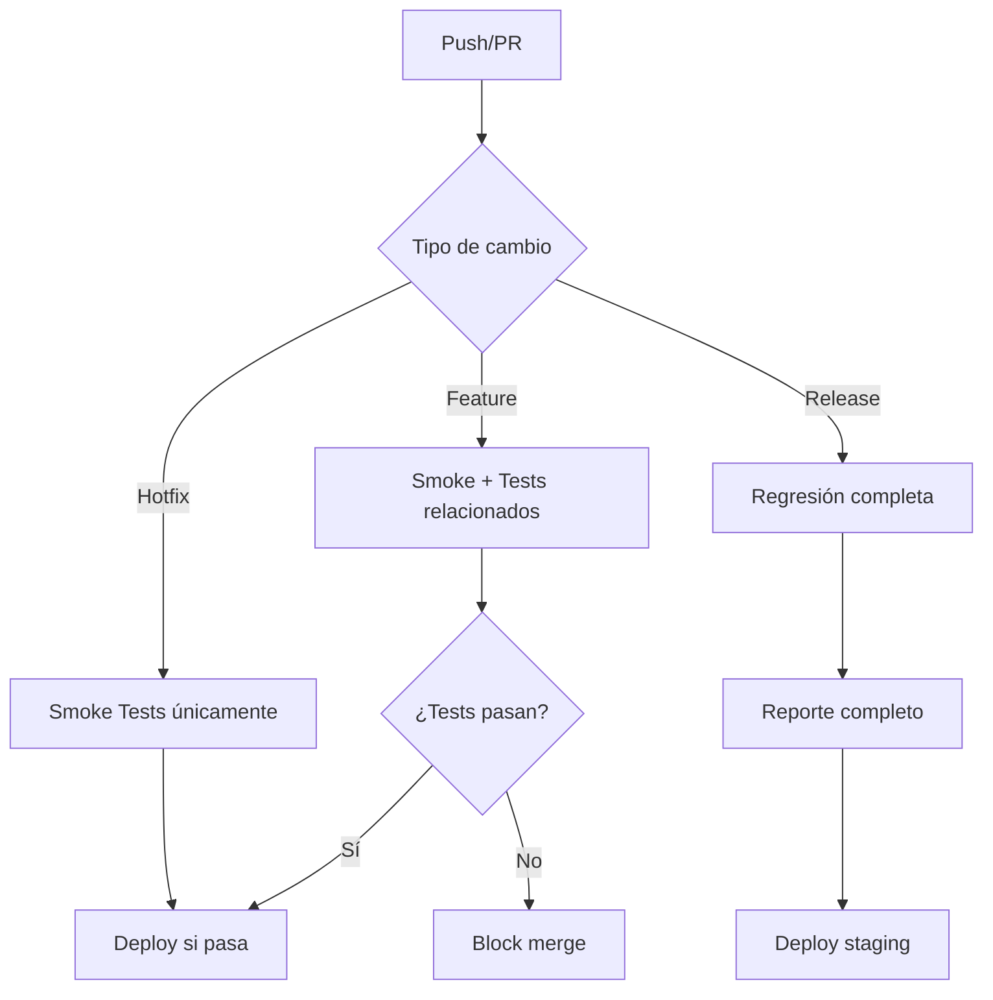

# 🚀 CI/CD Setup para InvoiceNinja

> 📋 Este documento describe cómo ejecutar la suite Playwright, generar reportes Allure y configurar un pipeline reproducible en GitHub Actions para el proyecto InvoiceNinja V2.

## 📖 Índice
1. [🎯 Objetivo](#-objetivo)
2. [✅ Requisitos Previos](#-requisitos-previos)
3. [🧰 Instalación y Configuración](#-instalación-y-configuración)
4. [▶️ Ejecutar Tests Localmente](#%EF%B8%8F-ejecutar-tests-localmente)
5. [📊 Generar Reportes Allure](#-generar-reportes-allure)
6. [🔄 GitHub Actions Workflow](#-github-actions-workflow)
7. [🛠️ Debugging y Artefactos](#%EF%B8%8F-debugging-y-artefactos)
8. [🏆 Mejores Prácticas](#-mejores-prácticas)
9. [📋 Comandos de Referencia Rápida](#-comandos-de-referencia-rápida)
10. [🚨 Solución de Problemas](#-solución-de-problemas)

## 🎯 Objetivo

Este documento proporciona una guía completa para:
- ⚡ Ejecutar la suite de pruebas E2E de forma local y automatizada
- 📊 Generar reportes detallados con Allure Framework
- 🔄 Configurar pipelines CI/CD con GitHub Actions
- 🛠️ Debugging efectivo de pruebas fallidas
- 📦 Gestión de artefactos y evidencias de testing

**🎯 Meta:** Facilitar un flujo de trabajo reproducible y escalable para el equipo de QA.

## ✅ Requisitos Previos

### 🖥️ Sistema Operativo
- **Windows 10/11** (PowerShell 5.1+)
- **macOS** (Zsh/Bash)
- **Linux** (Bash)

### 🔧 Software Requerido
| Componente | Versión Mínima | Instalación |
|------------|----------------|-------------|
| **Node.js** | 18.0.0+ | [Descargar](https://nodejs.org/) |
| **npm** | 9.0.0+ | Incluido con Node.js |
| **Git** | 2.40.0+ | [Descargar](https://git-scm.com/) |
| **Java JRE** | 11+ | [Adoptium](https://adoptium.net/) |
| **PowerShell** | 5.1+ | Windows nativo |

### 🌐 Navegadores (Automático)
- Chromium, Firefox, WebKit (instalados por Playwright)

### 📊 Herramientas Opcionales
- **Allure CLI** - Para reportes locales
- **VS Code** - IDE recomendado con extensiones Playwright

## 🧰 Instalación y Configuración

### 📦 Instalación Completa (PowerShell)

```powershell
# 1. Clonar el repositorio
git clone https://github.com/tu-usuario/InvoiceNinjaV2.git
cd InvoiceNinjaV2

# 2. Instalar dependencias del proyecto
npm install

# 3. Instalar navegadores Playwright con dependencias del sistema
npx playwright install --with-deps

# 4. Verificar instalación
npx playwright --version
node --version
npm --version
```

### 🎭 Instalación de Allure CLI (Opcional)

```powershell
# Opción 1: Chocolatey (Recomendado)
choco install allure -y

# Opción 2: Scoop
scoop install allure

# Opción 3: Manual (Windows)
# 1. Descargar desde: https://github.com/allure-framework/allure2/releases
# 2. Extraer a C:\allure
# 3. Agregar C:\allure\bin al PATH

# Verificar instalación
allure --version
```

### 🔧 Configuración Inicial

```powershell
# Crear directorios necesarios
New-Item -ItemType Directory -Force -Path "allure-results"
New-Item -ItemType Directory -Force -Path "allure-report"
New-Item -ItemType Directory -Force -Path "test-results"

# Configurar variables de entorno (opcional)
$env:PWDEBUG = "1"  # Para debugging
$env:CI = "false"   # Para ejecución local
```

> 💡 **Tip:** Si no instalas Allure localmente, puedes usar el pipeline CI para generar reportes o usar `allure-commandline` via npm.

## ▶️ Ejecutar Tests Localmente

### 🏃‍♂️ Comandos Básicos de Ejecución

```powershell
# Ejecutar toda la suite (128 tests)
npm test

# Ejecutar solo tests de regresión
npm run test:regression

# Ejecutar tests de smoke/sanity
npm run test_Smoke

# Ejecutar test específico (ejemplo: IN-16)
npm run test:single
```

### 🏷️ Ejecución por Tags

```powershell
# Tests de productos únicamente
npx playwright test --grep "@products"

# Tests de clientes únicamente
npx playwright test --grep "@clients"

# Tests de login únicamente
npx playwright test --grep "@login"

# Combinación de tags (productos Y sanity)
npx playwright test --grep "@products.*@sanity|@sanity.*@products"

# Tests negativos de productos
npx playwright test --grep "@products.*@negative"

# Solo tests de smoke
npx playwright test --grep "@smoke"
```

### 🎛️ Opciones Avanzadas de Ejecución

```powershell
# Ejecutar en navegador específico
npx playwright test --project=chromium
npx playwright test --project=firefox
npx playwright test --project=webkit

# Ejecutar en modo headed (visible)
npx playwright test --headed

# Ejecutar con debugging
npx playwright test --debug

# Ejecutar con paralelización personalizada
npx playwright test --workers=4

# Ejecutar con timeout personalizado
npx playwright test --timeout=60000

# Ejecutar test específico por nombre de archivo
npx playwright test tests/clients/createClients.spec.ts

# Ejecutar con retries
npx playwright test --retries=2
```

### 🔍 Ejecución con Filtros Específicos

```powershell
# Por descripción de test
npx playwright test --grep "should create client with billing address"

# Excluir tests específicos
npx playwright test --grep-invert "@skip"

# Ejecutar solo tests que contienen "IN-95"
npx playwright test --grep "IN-95"

# Tests de productos en chromium únicamente
npx playwright test --project=chromium --grep "@products"
```

## � Generar Reportes Allure

### 🎯 Scripts NPM Disponibles

| Script | Descripción | Comando |
|--------|-------------|---------|
| `test:allure` | Ejecuta tests + genera + abre reporte | `npm run test:allure` |
| `allure:generate` | Genera reporte HTML desde resultados | `npm run allure:generate` |
| `allure:open` | Abre servidor local del reporte | `npm run allure:open` |

### 📋 Flujo Completo de Reportes

```powershell
# 1. Ejecutar tests con generación de resultados Allure
npm test  # Los resultados se guardan en allure-results/

# 2. Generar reporte HTML (requiere Allure CLI)
npm run allure:generate

# 3. Abrir reporte en navegador
npm run allure:open

# 4. Flujo completo en un comando
npm run test:allure
```

### 🕒 Reportes con Timestamp

```powershell
# Generar reporte con timestamp para historial
$timestamp = Get-Date -Format "yyyy-MM-dd-HHmmss"
allure generate allure-results --clean -o "allure-report-$timestamp"

# Crear carpeta de reportes históricos
New-Item -ItemType Directory -Force -Path "reports-history"
allure generate allure-results --clean -o "reports-history/report-$timestamp"

# Abrir reporte específico
allure open "reports-history/report-$timestamp"
```

### 🚨 Sin Allure CLI Instalado

Si no tienes Allure CLI instalado localmente:

```powershell
# Opción 1: Usar allure-commandline via npm
npx allure-commandline generate allure-results --clean -o allure-report
npx allure-commandline open allure-report

# Opción 2: Usar Docker
docker run -p 4040:4040 -v ${PWD}/allure-results:/app/allure-results -v ${PWD}/allure-report:/app/allure-report frankescobar/allure-docker-service

# Opción 3: Solo generar en CI y descargar artefactos
# Ver sección de GitHub Actions más abajo
```

### 📊 Características del Reporte Allure

- **📈 Dashboard ejecutivo** con estadísticas de ejecución
- **🎯 Tests por categorías** (Smoke, Regression, Negative, etc.)
- **📸 Screenshots automáticos** en fallos
- **🎥 Videos** de ejecución completa
- **🕵️ Traces interactivos** para debugging
- **⏱️ Timeline** de ejecución con duraciones
- **🏷️ Filtros por tags** y severidad
- **📋 Historial** de ejecuciones (si se configura)

## � GitHub Actions Workflow

### 📁 Estructura de Archivos CI/CD

```
.github/
└── workflows/
    ├── playwright.yml          # Workflow principal
    ├── playwright-pr.yml       # Tests en Pull Requests
    └── nightly-regression.yml  # Tests nocturnos completos
```

### 🚀 Workflow Principal: `.github/workflows/playwright.yml`

```yaml
name: 🎭 Playwright E2E Tests

on:
  push:
    branches: [ 'main', 'develop', 'release/*' ]
  pull_request:
    branches: [ 'main', 'develop' ]
  workflow_dispatch:
    inputs:
      test_scope:
        description: 'Seleccionar scope de tests'
        required: true
        default: 'smoke'
        type: choice
        options:
          - smoke
          - regression
          - all
          - single
      browser:
        description: 'Navegador para ejecutar'
        required: true
        default: 'chromium'
        type: choice
        options:
          - chromium
          - firefox
          - webkit
          - all

jobs:
  test:
    name: 🧪 E2E Tests (${{ matrix.browser }})
    runs-on: ubuntu-latest
    timeout-minutes: 60
    
    strategy:
      fail-fast: false
      matrix:
        browser: ${{ github.event.inputs.browser == 'all' && fromJson('["chromium", "firefox", "webkit"]') || fromJson(format('["{0}"]', github.event.inputs.browser || 'chromium')) }}
    
    steps:
      - name: 📥 Checkout repository
        uses: actions/checkout@v4
        with:
          fetch-depth: 0

      - name: 📦 Setup Node.js
        uses: actions/setup-node@v4
        with:
          node-version: '18'
          cache: 'npm'

      - name: 📚 Install dependencies
        run: npm ci

      - name: 🎭 Install Playwright browsers
        run: npx playwright install --with-deps ${{ matrix.browser }}

      - name: 🧪 Run Playwright tests
        env:
          CI: true
        run: |
          case "${{ github.event.inputs.test_scope || 'smoke' }}" in
            "smoke")
              npm run test_Smoke -- --project=${{ matrix.browser }}
              ;;
            "regression")
              npm run test:regression -- --project=${{ matrix.browser }}
              ;;
            "all")
              npm test -- --project=${{ matrix.browser }}
              ;;
            "single")
              npm run test:single -- --project=${{ matrix.browser }}
              ;;
          esac

      - name: 📊 Upload Playwright report
        uses: actions/upload-artifact@v4
        if: always()
        with:
          name: playwright-report-${{ matrix.browser }}
          path: playwright-report/
          retention-days: 30

      - name: 📋 Upload Allure results
        uses: actions/upload-artifact@v4
        if: always()
        with:
          name: allure-results-${{ matrix.browser }}
          path: allure-results/
          retention-days: 30

      - name: 🎯 Generate Allure report
        if: always()
        run: |
          # Instalar Java para Allure
          sudo apt-get update
          sudo apt-get install -y openjdk-11-jre-headless
          
          # Instalar Allure CLI
          curl -o allure-commandline.zip -Ls https://github.com/allure-framework/allure2/releases/download/2.24.0/allure-2.24.0.zip
          unzip -q allure-commandline.zip
          sudo mv allure-* /opt/allure
          sudo ln -s /opt/allure/bin/allure /usr/local/bin/allure
          
          # Generar reporte
          allure generate allure-results --clean -o allure-report

      - name: 📄 Upload Allure HTML report
        uses: actions/upload-artifact@v4
        if: always()
        with:
          name: allure-html-report-${{ matrix.browser }}
          path: allure-report/
          retention-days: 30

      - name: 💾 Upload test videos (on failure)
        uses: actions/upload-artifact@v4
        if: failure()
        with:
          name: test-videos-${{ matrix.browser }}
          path: test-results/
          retention-days: 7

  # Job para combinar reportes de múltiples navegadores
  combine-reports:
    name: 📊 Combine Test Reports
    if: always() && needs.test.result != 'skipped'
    needs: test
    runs-on: ubuntu-latest
    
    steps:
      - name: 📥 Download all artifacts
        uses: actions/download-artifact@v4
        with:
          pattern: allure-results-*
          merge-multiple: true
          path: combined-allure-results

      - name: 🔗 Generate combined Allure report
        run: |
          # Instalar herramientas necesarias
          sudo apt-get update && sudo apt-get install -y openjdk-11-jre-headless
          curl -o allure.zip -Ls https://github.com/allure-framework/allure2/releases/download/2.24.0/allure-2.24.0.zip
          unzip -q allure.zip && sudo mv allure-* /opt/allure
          sudo ln -s /opt/allure/bin/allure /usr/local/bin/allure
          
          # Generar reporte combinado
          allure generate combined-allure-results --clean -o combined-allure-report

      - name: 📊 Upload combined report
        uses: actions/upload-artifact@v4
        with:
          name: 🎯-COMBINED-ALLURE-REPORT
          path: combined-allure-report/
          retention-days: 30

  # Job para notificaciones (opcional)
  notify:
    name: 📢 Notify Results
    if: always()
    needs: [test, combine-reports]
    runs-on: ubuntu-latest
    
    steps:
      - name: 📊 Test Results Summary
        run: |
          echo "## 🎭 Playwright Test Results" >> $GITHUB_STEP_SUMMARY
          echo "| Browser | Status |" >> $GITHUB_STEP_SUMMARY
          echo "|---------|---------|" >> $GITHUB_STEP_SUMMARY
          echo "| Chromium | ${{ needs.test.outputs.chromium-status || '❓' }} |" >> $GITHUB_STEP_SUMMARY
          echo "| Firefox | ${{ needs.test.outputs.firefox-status || '❓' }} |" >> $GITHUB_STEP_SUMMARY
          echo "| WebKit | ${{ needs.test.outputs.webkit-status || '❓' }} |" >> $GITHUB_STEP_SUMMARY
          echo "" >> $GITHUB_STEP_SUMMARY
          echo "📊 **Reportes disponibles en Artifacts**" >> $GITHUB_STEP_SUMMARY
```

### 🎯 Workflows Adicionales

#### `.github/workflows/playwright-pr.yml` - Tests en Pull Requests

```yaml
name: 🔍 PR Quality Check

on:
  pull_request:
    branches: [ 'main', 'develop' ]

jobs:
  smoke-tests:
    name: 🚀 Smoke Tests
    runs-on: ubuntu-latest
    steps:
      - uses: actions/checkout@v4
      - uses: actions/setup-node@v4
        with:
          node-version: '18'
          cache: 'npm'
      - run: npm ci
      - run: npx playwright install chromium
      - run: npm run test_Smoke -- --project=chromium
      
      - name: 📊 Comment PR with results
        uses: actions/github-script@v6
        if: always()
        with:
          script: |
            const fs = require('fs');
            // Leer resultados y comentar en PR
            // Implementar lógica de comentarios automáticos
```

#### `.github/workflows/nightly-regression.yml` - Tests Nocturnos

```yaml
name: 🌙 Nightly Regression

on:
  schedule:
    - cron: '0 2 * * *'  # Diario a las 2 AM UTC
  workflow_dispatch:

jobs:
  full-regression:
    name: 🧪 Full Regression Suite
    runs-on: ubuntu-latest
    strategy:
      matrix:
        browser: [chromium, firefox, webkit]
    steps:
      - uses: actions/checkout@v4
      - uses: actions/setup-node@v4
        with:
          node-version: '18'
      - run: npm ci
      - run: npx playwright install --with-deps
      - run: npm run test:regression -- --project=${{ matrix.browser }}
      # ... más pasos para reportes y notificaciones
```

### 🏷️ Variables de Entorno CI

Agregar en Settings → Secrets and variables → Actions:

```yaml
# Secrets (valores sensibles)
secrets:
  SLACK_WEBHOOK_URL: ${{ secrets.SLACK_WEBHOOK_URL }}
  TEAMS_WEBHOOK_URL: ${{ secrets.TEAMS_WEBHOOK_URL }}

# Variables (valores públicos)
vars:
  DEFAULT_BROWSER: chromium
  TIMEOUT_MINUTES: 60
  RETENTION_DAYS: 30
```

## 🛠️ Debugging y Artefactos

### 🔍 Artefactos Generados por CI

| Artefacto | Descripción | Uso | Retención |
|-----------|-------------|-----|-----------|
| **allure-results** | Datos en formato JSON | Regenerar reportes localmente | 30 días |
| **allure-html-report** | Reporte visual HTML | Ver directamente en navegador | 30 días |
| **playwright-report** | Reporte nativo de Playwright | Análisis técnico detallado | 30 días |
| **test-videos** | Videos de fallos | Debugging visual | 7 días |
| **screenshots** | Capturas en fallos | Evidencia rápida | 7 días |

### 🎥 Debugging Local con Artefactos Descargados

```powershell
# 1. Descargar artefactos desde GitHub Actions
# 2. Extraer ZIP en carpeta local
Expand-Archive -Path "allure-results.zip" -DestinationPath "./downloaded-results"

# 3. Regenerar reporte con datos descargados
allure generate downloaded-results/allure-results --clean -o local-debug-report

# 4. Abrir para análisis
allure open local-debug-report

# 5. Analizar videos de fallos (si disponibles)
explorer test-results/  # Windows
```

### 🚨 Debugging Avanzado en CI

```yaml
# Agregar al workflow para debugging detallado
- name: 🐛 Debug on failure
  if: failure()
  run: |
    echo "=== Test Environment ==="
    node --version
    npm --version
    npx playwright --version
    
    echo "=== Failed Test Analysis ==="
    find test-results -name "*.webm" | head -5
    
    echo "=== System Resources ==="
    df -h
    free -m
    
    echo "=== Network Connectivity ==="
    curl -I https://invoice-ninja-demo.com || echo "Demo site unreachable"

# Habilitar debugging interactivo (solo manual)
- name: 🎯 Interactive debugging
  if: github.event.inputs.debug == 'true'
  uses: mxschmitt/action-tmate@v3
  timeout-minutes: 30
```

### 📊 Análisis de Fallos Comunes

| Error | Causa Probable | Solución |
|-------|----------------|----------|
| **TimeoutError** | Elemento no encontrado | Verificar selectores + waits |
| **NavigationError** | Sitio caído/lento | Retry logic + health check |
| **PermissionDenied** | Credenciales inválidas | Verificar datos de test |
| **ElementNotVisible** | Timing de carga | Agregar wait conditions |
| **NetworkError** | Conectividad | Verificar URL + proxies |

## 🏆 Mejores Prácticas

### 🎯 Principios de Testing

- **🔄 Tests Idempotentes:** Cada test debe funcionar independientemente
- **🗃️ Datos Únicos:** Usar timestamps/UUIDs para evitar colisiones
- **🧹 Cleanup Automático:** Limpiar datos después de cada test
- **⚡ Paralelización:** Aprovechar workers para velocidad
- **🎭 Cross-Browser:** Validar en múltiples navegadores

### 📋 Estrategia de Ejecución CI/CD



### 🚀 Estrategia de Branches y Tests

| Branch | Trigger | Tests Ejecutados | Duración |
|--------|---------|------------------|----------|
| **feature/** | Push | Smoke (@smoke) | ~5 min |
| **develop** | PR merge | Regression | ~20 min |
| **main** | Release | Full suite | ~45 min |
| **Nightly** | Schedule | Cross-browser full | ~2 horas |

### ⚡ Optimización de Performance

```powershell
# Tests en paralelo optimizado
npx playwright test --workers=50% --project=chromium

# Solo generar videos en fallos
npx playwright test --config=playwright-ci.config.ts

# Cache de instalación de navegadores
# (GitHub Actions automáticamente cachea)
```

### 🛡️ Gestión de Datos de Test

```javascript
// ✅ CORRECTO: Datos únicos por test
const clientData = {
    company: {
        name: `TestClient_${Date.now()}_${Math.random()}`
    }
};

// ❌ INCORRECTO: Datos estáticos que causan conflictos
const clientData = {
    company: {
        name: "Test Client Company"  // Causa fallos en paralelo
    }
};
```

## � Comandos de Referencia Rápida

### ⚡ Setup Inicial (Una sola vez)

```powershell
# Clonar y configurar proyecto
git clone <repo-url> && cd InvoiceNinjaV2
npm install
npx playwright install --with-deps
choco install allure -y  # Opcional para reportes locales
```

### 🧪 Ejecución de Tests

```powershell
# Comandos más usados
npm test                           # Suite completa (128 tests)
npm run test:regression           # Tests de regresión
npm run test_Smoke               # Tests críticos (smoke)
npm run test:single              # Test individual (IN-16)

# Por tags específicos
npx playwright test --grep "@products"      # Solo productos
npx playwright test --grep "@clients"       # Solo clientes
npx playwright test --grep "@smoke"         # Solo smoke tests

# Navegadores específicos
npx playwright test --project=chromium      # Solo Chrome
npx playwright test --project=firefox       # Solo Firefox
```

### 📊 Reportes Allure

```powershell
# Flujo completo
npm run test:allure              # Test + generar + abrir reporte

# Pasos individuales
npm test                         # Ejecutar (genera allure-results)
npm run allure:generate         # Generar HTML
npm run allure:open             # Abrir navegador

# Con timestamp para historial
$ts = Get-Date -Format "yyyy-MM-dd-HHmmss"
allure generate allure-results --clean -o "allure-report-$ts"
```

### 🔧 Debugging y Utilidades

```powershell
# Debugging visual
npx playwright test --headed --debug

# Solo un test específico
npx playwright test tests/clients/createClients.spec.ts -g "IN-95"

# Limpiar artefactos
Remove-Item -Recurse -Force allure-results, allure-report, test-results

# Ver qué tests se ejecutarían (dry-run)
npx playwright test --list

# Verificar configuración
npx playwright --version && node --version && allure --version
```

## 🚨 Solución de Problemas

### ❌ Errores Comunes y Soluciones

| Problema | Error | Solución |
|----------|-------|----------|
| **Allure no reconocido** | `'allure' is not recognized` | Instalar Allure CLI: `choco install allure -y` |
| **Navegadores faltantes** | `Browser executable not found` | Ejecutar: `npx playwright install --with-deps` |
| **Puerto ocupado** | `Port 4040 already in use` | Cambiar puerto: `allure open --port 4041` |
| **Tests colgados** | `Test timeout 30000ms exceeded` | Aumentar timeout en `playwright.config.ts` |
| **Permisos en Windows** | `PowerShell execution policy` | Ejecutar: `Set-ExecutionPolicy -ExecutionPolicy RemoteSigned -Scope CurrentUser` |

### 🆘 Debugging Paso a Paso

```powershell
# 1. Verificar instalaciones
node --version        # Debe ser 18+
npm --version        # Debe ser 9+
npx playwright --version    # Debe mostrar versión instalada

# 2. Reinstalar si hay problemas
Remove-Item -Recurse -Force node_modules
npm cache clean --force
npm install
npx playwright install --with-deps

# 3. Test básico
npx playwright test --list | head -10  # Ver primeros 10 tests
npx playwright test --grep "@smoke" --project=chromium  # Test simple

# 4. Si persisten errores, generar trace
npx playwright test --trace on --project=chromium
# Los traces se guardan en test-results/ para análisis visual
```

### 📞 Soporte y Recursos

- **📖 Documentación Playwright:** https://playwright.dev/
- **📊 Allure Framework:** https://docs.qameta.io/allure/
- **📧 Contacto QA Lead:** edelgadillo2002@gmail.com

---


**🎯 Última actualización:** $(Get-Date -Format "yyyy-MM-dd") | **📊 Tests activos:** 128 | **🏷️ Tags disponibles:** @smoke, @regression, @products, @clients, @login, @negative